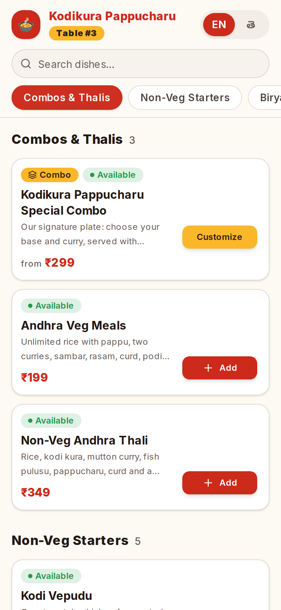
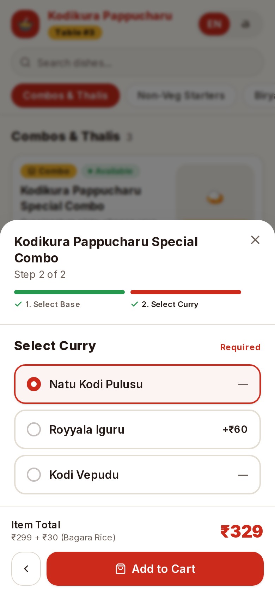
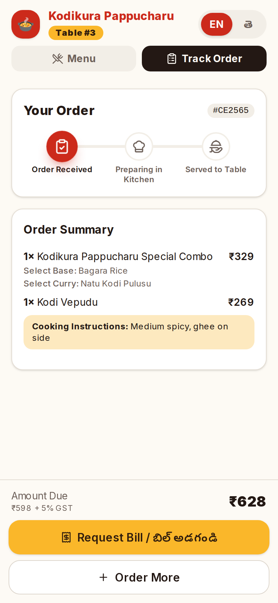
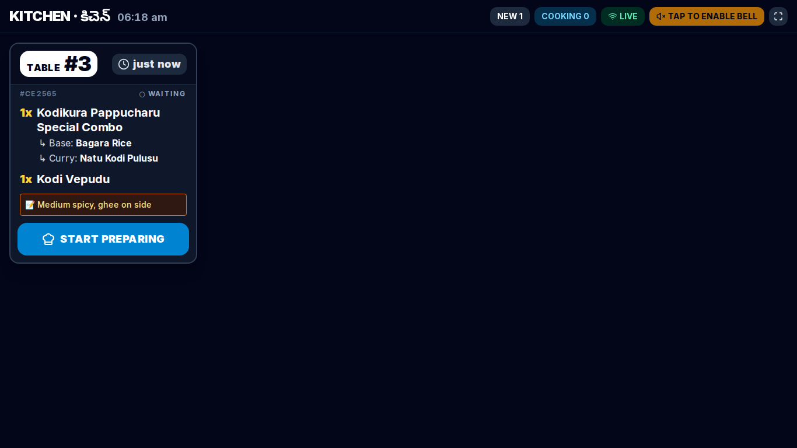
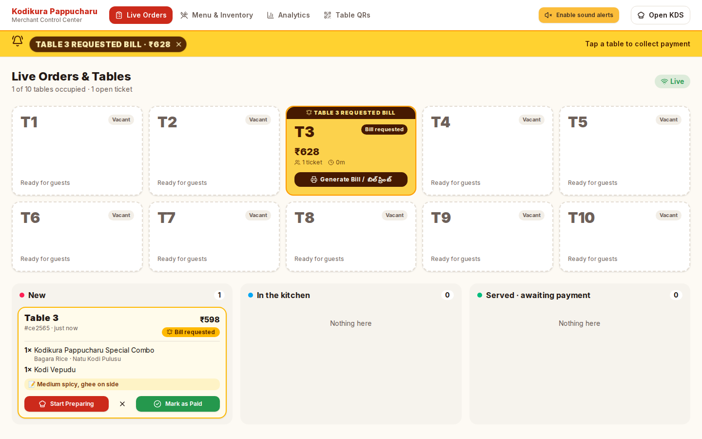
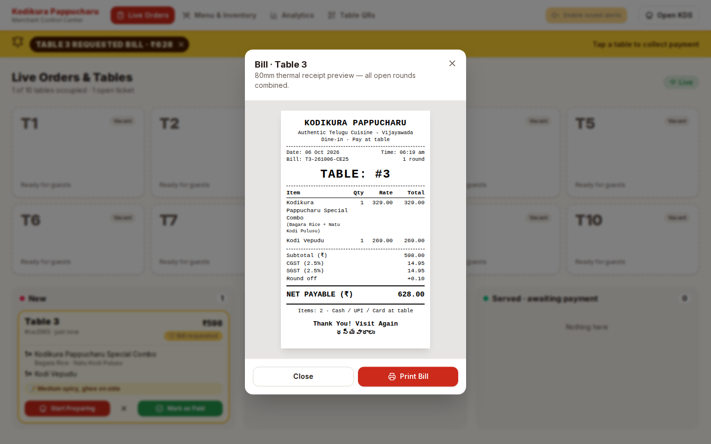
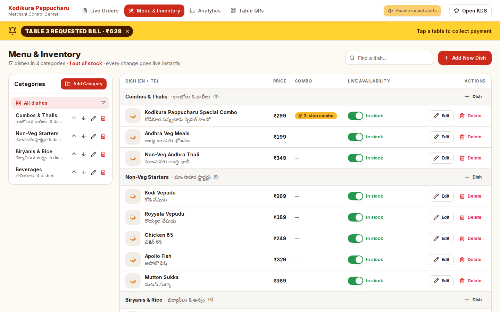
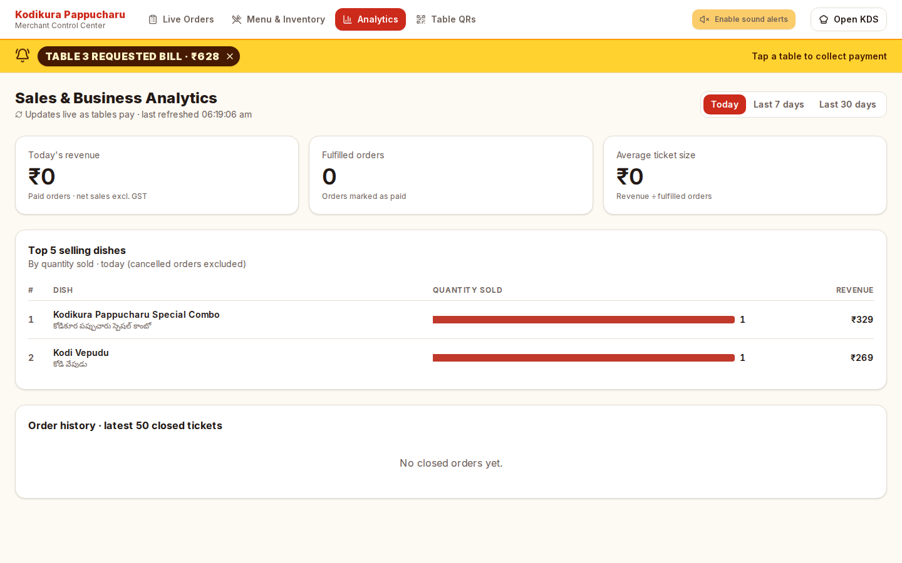
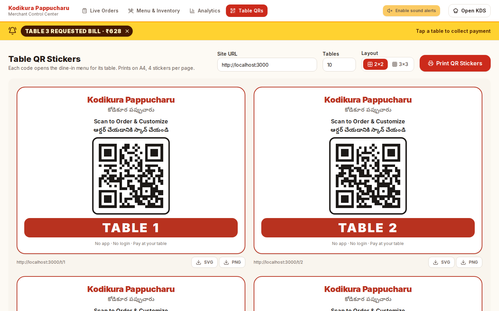

# Kodikura Pappucharu — Dine-In System

QR-based dine-in ordering for a busy Telugu restaurant. Guests scan a table QR, browse a bilingual
(English / తెలుగు) menu, build combos, order and track their food live, and tap **Request Bill** when
they're done. Staff run everything from a merchant dashboard and a kitchen display. Payment happens at the
table with the server; there are no customer logins and no online payment gateway.

| Surface | Route | Who |
| --- | --- | --- |
| Guest menu, cart, order tracking, bill request | `/t/[tableId]` | Guests (mobile) |
| **Live Orders**: table grid, bill alerts, table drawer with "Mark as Paid / Cash Collected", ticket pipeline | `/admin` (`?tab=orders`) | Floor manager / cashier |
| **Menu & Inventory**: self-serve CMS: categories (add/rename/reorder/delete), dishes (create/edit/delete/restore), visual combo-step editor, instant stock switches | `/admin?tab=menu` | Manager |
| **Analytics**: today's revenue, fulfilled orders, average ticket, top 5 dishes, history | `/admin?tab=analytics` | Owner |
| **Table QRs**: printable A4 stickers (2×2 / 3×3), SVG/PNG download | `/admin/qr` | Manager |
| Kitchen Display System (dark, high contrast, bell + urgency colours) | `/kds` | Kitchen |

## Architecture

```
┌──────────── web/ (Vercel) ────────────┐        ┌──────── server/ (Render) ────────┐
│ Next.js 15 App Router · TS · Tailwind │  REST  │ Express  /api/*                  │
│ shadcn-style UI · Lucide · Zustand    │ ─────▶ │ Socket.IO gateway (rooms)        │──▶ PostgreSQL
│ socket.io-client                      │ ◀───── │ Prisma ORM · zod validation      │    (Prisma migrations)
└───────────────────────────────────────┘   WS   └──────────────────────────────────┘
```

* **The server is the source of truth.** Order totals are always recomputed server-side from the live menu
  and the combo configuration; client prices are display-only. Unavailable items are rejected with `409`
  and the guest's cart drops them automatically.
* **Realtime events are emitted only after the DB transaction commits.** Every screen also refetches on
  socket reconnect, so a dropped connection never leaves stale state.
* **Status changes are race-safe:** transitions are validated (`pending → preparing → served → paid`, cancel
  from pending/preparing) and applied with an optimistic `WHERE status = <current>` guard, so two staff
  screens tapping the same ticket can't double-advance it.

### Repository layout

```
server/
  prisma/schema.prisma        # RestaurantTable, Category, MenuItem, ComboConfig, Order, OrderItem
  prisma/migrations/          # SQL migrations (prisma migrate)
  prisma/seed.ts              # Tables 1–10 + 4 categories / 17 bilingual dishes + 2-step Special Combo
  src/index.ts                # Express app, security middleware, HTTP + Socket.IO bootstrap
  src/socket.ts               # Realtime gateway: room joins + order/menu/table command handlers (acks)
  src/realtime.ts             # Typed broadcast helpers (emit only after DB commit)
  src/events.ts               # Event names & room names
  src/routes/{menu,orders,tables,analytics}.ts
  src/services/actions.ts     # createOrder / updateOrderStatus / toggleAvailability / requestBill — shared by REST + sockets
  src/services/orders.ts      # Server-side pricing, combo validation, status transitions
  scripts/socket-smoke.ts     # End-to-end realtime test (npm run test:socket)
  src/lib/{schemas,serialize,http}.ts
  src/middleware/{staffAuth,errors}.ts
web/
  src/app/                    # Routes: /t/[tableId], /admin/*, /kds (+ error boundaries)
  src/components/ui/          # Button, Badge, Card, Input, Switch, Dialog, Spinner (shadcn-style)
  src/components/customer/    # CustomerApp, CustomerHeader, CategoryNav (scroll-spy), MenuItemCard,
                              # ComboBuilderModal, CartDrawer (sticky bar + slide-up drawer), OrderTracker
  src/components/admin/       # AdminShell (tabs + BillAlertBanner), LiveOrdersTab, TableDetailsDrawer,
                              # MenuInventoryTab, CategoryManager, MenuItemModal, ComboConfigEditor,
                              # AnalyticsTab, QrStickerSheet,
                              # ThermalReceipt + ReceiptDialog (80mm bill)
  src/components/kds/         # KdsBoard, KdsTicket
  src/store/                  # Zustand: useCustomerStore (table, language, cart, activeOrder), useStaffStore
  src/hooks/                  # useSocket (rooms on the shared socket + refetch on reconnect), useTranslation, useNow
  src/lib/                    # socketClient (singleton, acked commands, connection state), staffActions, billing (GST),
                              # translations (EN/తెలుగు),
                              # api, types, chime (MP3 via HTML5 Audio, Web Audio synth fallback)
  public/sounds/              # kitchen-bell.mp3 (KDS), chime.mp3 (dashboard alerts)
```

## Screenshots

| Guest menu | Combo builder | Order tracking |
| --- | --- | --- |
|  |  |  |

| Kitchen display | Live orders + bill alert | 80mm thermal bill |
| --- | --- | --- |
|  |  |  |

| Menu CMS | Analytics | Table QR stickers |
| --- | --- | --- |
|  |  |  |

## Quick start (Docker, one command)

Needs only [Docker Desktop](https://www.docker.com/products/docker-desktop/), with no Node or
PostgreSQL install.

```bash
git clone -b claude/laughing-hopper-ugfa96 https://github.com/karthikeyakakarlapudi2007/CP-KKP
cd CP-KKP
docker compose up --build
```

The first build takes a few minutes. Then open:

| Screen | URL |
| --- | --- |
| Home | http://localhost:3000 |
| Guest menu (table 1) | http://localhost:3000/t/1 |
| Merchant dashboard | http://localhost:3000/admin |
| Kitchen display | http://localhost:3000/kds |
| Table QR stickers | http://localhost:3000/admin/qr |
| API health | http://localhost:4000/health |

The database is migrated and seeded automatically (tables 1–10 + the Telugu menu) and kept in a Docker
volume between runs. To test on **phones on the same Wi-Fi**, start it with your computer's LAN IP so
the QR codes and API use an address the phone can reach:

```bash
HOST_IP=192.168.1.25 docker compose up --build              # macOS / Linux
$env:HOST_IP="192.168.1.25"; docker compose up --build      # Windows PowerShell
```

Stop with `Ctrl+C` (or `docker compose down`). `docker compose down -v` also deletes the database.

## Local development

Requires Node 20+ and PostgreSQL 14+.

```bash
# 1. API + realtime server
cd server
cp .env.example .env            # set DATABASE_URL
npm install
npm run db:migrate              # creates the schema (prisma migrate dev)
npm run db:seed                 # tables 1–10 + menu (idempotent)
npm run dev                     # API + socket server on http://localhost:4000
npm run test:socket             # (second terminal) end-to-end realtime checks

# 2. Web app (new terminal)
cd web
cp .env.example .env.local      # NEXT_PUBLIC_API_URL=http://localhost:4000
npm install
npm run dev                     # http://localhost:3000
```

Open `http://localhost:3000/t/1` on a phone-sized viewport, `/kds` in another window and `/admin` in a third,
then place an order and watch it flow through.

## Self-serve menu CMS (`/admin?tab=menu`)

Staff run the whole menu from the browser, and every save broadcasts `menu:updated` so guest phones
refresh in the background with no reload.

* **CategoryManager.** Add, rename, reorder with up/down arrows (`PUT /api/categories/reorder`, one
  transaction) and filter the dish table. Delete is **blocked** while live dishes use the category. A
  category holding only archived dishes is archived instead of erased.
* **MenuItemModal** (create + edit). Category, EN/TE names (the Telugu name must be in Telugu script),
  EN/TE descriptions, price (`249` / `249.50`, up to ₹1,00,000), image URL with a live preview, in-stock
  switch and an `is_combo` checkbox. Field errors show inline, and toasts report success or failure.
* **ComboConfigEditor.** `+ Add Step`, EN/TE step titles, mandatory flag, "guests pick up to N",
  reorderable steps, and options (EN, TE, extra ₹), plus a preview of what guests will see. Saved to
  `ComboConfig` (option ids are kept across edits). The guest combo builder renders whatever is configured.
* **Delete & archive.** A dish that was never ordered is deleted. A dish that appears on any past order is
  **archived** (`archived_at`): hidden from guests and staff lists, unorderable, but its order lines,
  receipts and analytics stay intact. It can be restored from "Archived dishes" and comes back out of stock
  for review.
* **Guest carts stay honest.** When the menu changes, carts are re-validated and re-priced. Lines whose
  options were removed are dropped, prices update, and the guest sees a notice.

## Rush-hour behaviour

* **Several guests, one table.** Every phone that scans a table's QR joins the same live room. If the table
  already has open tickets, the menu shows an **Active Table Order in Progress** banner with the running
  bill and what has already been ordered, and the cart button becomes **Place Add-on Order · Round N**.
* **Add-on rounds.** A mid-meal order never edits earlier tickets. It becomes a linked ticket with
  `round = N` and is broadcast as `order:addon_created`. The KDS shows it as `TABLE # (ADD-ON / ROUND N)`
  with a violet badge and glow. Ordering again after "Request Bill" re-opens the bill (the table goes back
  to `occupied`), so staff never print an incomplete bill.
* **No races.** Creating orders, changing status, requesting the bill and settling all take a row lock on
  the table (`SELECT … FOR UPDATE`). Twelve simultaneous orders on one table get rounds 1–12 with no
  duplicates.
* **Patchy mobile data.** The shared socket reports `connecting / connected / reconnecting / disconnected`.
  Guests see an amber "Connecting to restaurant server... / సర్వర్‌కి కనెక్ట్ అవుతోంది..." pill. The
  socket retries forever with backoff and also reconnects when the phone comes back online or the tab
  becomes visible. After reconnecting it re-joins `table:<n>` and re-fetches orders. Short drops (under
  2 min) are bridged by Socket.IO connection-state recovery.

## Billing & the 80mm thermal receipt

Menu prices are pre-tax. The bill adds GST split into CGST and SGST (`NEXT_PUBLIC_GST_RATE`, default 5),
then rounds to the nearest rupee, with all maths done in paise. Guests, the dashboard and the receipt all
show the same net payable. Revenue in Analytics is net sales **excluding** GST.

In **Live Orders**, every occupied table has **Generate Bill / బిల్ ప్రింట్**. It opens a preview of
`ThermalReceipt`: 80mm wide, monochrome, all rounds merged, with subtotal, CGST, SGST, round off and net
payable. **Print Bill** hides everything except the receipt and sets `@page` to exactly 80mm × the
receipt's height, so thermal printers cut right after the footer.

## Configuration

**server/.env**

| Variable | Purpose |
| --- | --- |
| `DATABASE_URL` | PostgreSQL connection string |
| `PORT` | HTTP port (default `4000`) |
| `CORS_ORIGIN` | Comma-separated allowed origins for REST and WebSockets. `*` matches one DNS label, e.g. `http://localhost:3000,https://kodikura.vercel.app,https://kodikura-*.vercel.app` |
| `STAFF_API_KEY` | Optional shared key for staff screens & endpoints. When set, `/admin` and `/kds` ask for it once per device. Leave empty only for local development. |
| `TZ_OFFSET_MINUTES` | Restaurant timezone offset for "today" analytics (IST = `330`) |

**web/.env.local**

| Variable | Purpose |
| --- | --- |
| `NEXT_PUBLIC_API_URL` | Public URL of the Render service |
| `NEXT_PUBLIC_SITE_URL` | Public URL of the web app, encoded into table QR codes (defaults to the current origin) |
| `NEXT_PUBLIC_SOCKET_URL` | Socket.IO URL. Empty means use `NEXT_PUBLIC_API_URL` (same Render service) |
| `NEXT_PUBLIC_GST_RATE` | GST % added to bills, split CGST/SGST (default `5`; `0` if prices include tax) |

## Deployment

`.env.example` at the repo root documents every variable for both apps. `npm run build` at the root
builds the server and then the web app.

**Backend (Render):** `render.yaml` is a Blueprint that provisions PostgreSQL and the `server/` web service.
It runs `prisma migrate deploy` plus the idempotent seed before each deploy, and generates a random
`STAFF_API_KEY` (find it in the Render dashboard and share it with staff). Set `CORS_ORIGIN` to the Vercel
URL. Socket.IO works on Render web services without extra config. Keep the service on a paid instance,
because free instances sleep and drop every live socket. Keep it to one instance unless you add a
Socket.IO adapter (rooms live in memory). `GET /health` returns `{ status: "ok", timestamp, database }`
and responds 503 if PostgreSQL is unreachable.

**Frontend (Vercel):** import the repo, set **Root Directory** to `web`, and add `NEXT_PUBLIC_API_URL` and
`NEXT_PUBLIC_SITE_URL`. Then print the QR codes from `/admin/qr`.

### Server scripts

| Script | What it does |
| --- | --- |
| `npm run dev` / `npm run socket:dev` | Start the Express + Socket.IO server with hot reload |
| `npm run build` then `npm start` / `npm run socket:start` | Production build and start |
| `npm run db:migrate` | Create/apply migrations in development (`prisma migrate dev`) |
| `npm run db:deploy` | Apply committed migrations (production) |
| `npm run db:seed` | Seed tables 1–10 and the menu (skips the menu if one exists) |
| `npm run db:setup` | `db:deploy` + `db:seed` in one go |
| `npm run db:reset` | Drop and recreate the database, then re-seed. **Destroys all data. Use on dev databases only.** |
| `npm run test:socket` | Run the realtime smoke test against a running server |

## Realtime engine

Clients emit `join` with `{ role: "customer", table }` or `{ role: "admin" | "kds", staffKey }` and are placed
in the matching room (`table:<n>`, `admin`, `kds`).

### Commands (client → server, answered via Socket.IO acknowledgement)

Every command replies with `{ ok: true, data }` or `{ ok: false, status, error, details? }`, for example
`socket.emitWithAck("order:create", payload)`. Each command runs the same service function as its REST twin.

| Command | Who may send | Payload | Effect |
| --- | --- | --- | --- |
| `order:create` | anyone (20/min per connection) | `{ table_number, customer_notes?, items: [{ menu_item_id, quantity, item_notes?, combo_selections?: { "<step>": [optionId] } }] }` | Prices & saves the order + items; table → `occupied`; emits `order:created` |
| `order:update_status` | sockets joined as `admin` or `kds` | `{ order_id, status: "preparing" \| "served" \| "paid" \| "cancelled" }` | Validated transition; emits `order:status_changed`; paying the last open order frees the table |
| `menu:toggle_availability` | sockets joined as `admin` | `{ menu_item_id, is_available }` | Updates stock; emits `menu:availability_toggled` to everyone |
| `table:request_bill` | anyone | `{ table_number }` | Table → `bill_requested`; emits `table:bill_requested` |

### Broadcasts (server → client)

| Event | Recipients | Payload |
| --- | --- | --- |
| `order:created` | admin, kds, `table:<n>` | full order (round 1) |
| `order:addon_created` | admin, kds, `table:<n>` | full order (round ≥ 2, added mid-meal) |
| `order:status_changed` | `table:<n>`, kds, admin | full order |
| `menu:availability_toggled` | everyone | `{ menu_item_id, is_available }` |
| `menu:updated` | everyone | `{ at }` (dish/category edits → clients refetch) |
| `table:bill_requested` | admin (alert sound), `table:<n>` | `{ table_number, amount_due, order_ids }` |
| `table:status_updated` | admin, kds, `table:<n>` | `{ id, status }` |

## REST API

Public (guest) endpoints are rate-limited where they write; staff endpoints need `x-staff-key` when
`STAFF_API_KEY` is set.

| Method & path | Access | Description |
| --- | --- | --- |
| `GET /api/menu` | public | Categories → items → combo steps |
| `GET /api/tables/:ref` | public | Validate a table by number or QR token |
| `GET /api/tables/:ref/orders` | public | The table's open orders (guest tracking) |
| `POST /api/orders` | public | Place an order (priced server-side) |
| `POST /api/tables/:ref/request-bill` | public | Flag the table `bill_requested` |
| `GET /api/orders?scope=active\|history` | staff | Open tickets / closed history |
| `PATCH /api/orders/:id/status` | staff | `preparing` · `served` · `paid` · `cancelled` |
| `GET /api/tables` | staff | Floor overview with amount due |
| `POST /api/tables/:ref/settle` | staff | Mark every open order on a table paid, reset to vacant |
| `PATCH /api/menu-items/:id/availability` | staff | Instant stock toggle |
| `POST/PUT/DELETE /api/menu-items[/:id]` | staff | Dish CRUD incl. combo steps. DELETE archives dishes with order history |
| `POST /api/menu-items/:id/restore` | staff | Bring an archived dish back (out of stock) |
| `POST/PUT/DELETE /api/categories[/:id]` | staff | Category CRUD. DELETE is blocked while live dishes are linked |
| `PUT /api/categories/reorder` | staff | `{ ids: [...] }` sets sort order 10, 20, 30… atomically |
| `GET /api/menu?include_archived=1` | staff | Menu including archived dishes and categories |
| `GET /api/analytics/summary?range=today\|7d\|30d` | staff | Revenue, fulfilled orders, average ticket, top dishes |

## Behaviour notes

* **Mark as Paid** closes the ticket (status `paid`, which archives it into history). When a table has no
  other open orders, it resets to `vacant`. Tapping a table on the floor map settles all of its orders at once.
* Combo steps support mandatory/optional steps and multi-select limits (`is_required`, `max_select` on
  `ComboConfig`). Selected options are snapshotted onto each `OrderItem`, so later menu edits never change
  past orders.
* Browsers block audio until someone interacts with the page, so the KDS and dashboard show a one-tap
  "enable sound" button. Sounds play from `/public/sounds/*.mp3` through HTML5 Audio. If a file can't be
  loaded or decoded, an equivalent chime is synthesised with the Web Audio API.
* The KDS sorts tickets strictly oldest-first. New tickets glow for 5 s, timers turn orange at 8 min and
  flash red at 15 min, and a ticket leaves the screen when it is marked served.
* Bill-request alerts are dashboard-wide: the banner and sound fire on whichever admin tab is open.
